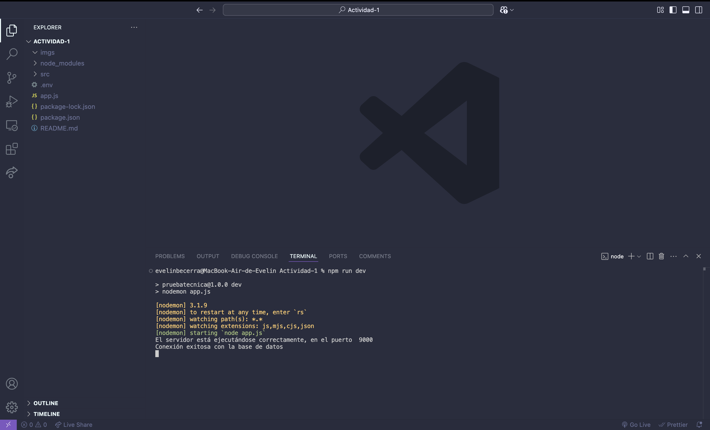
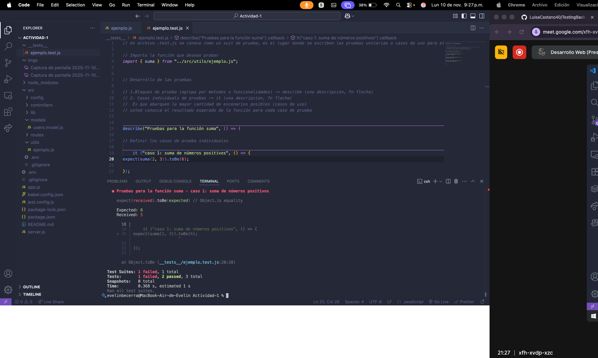
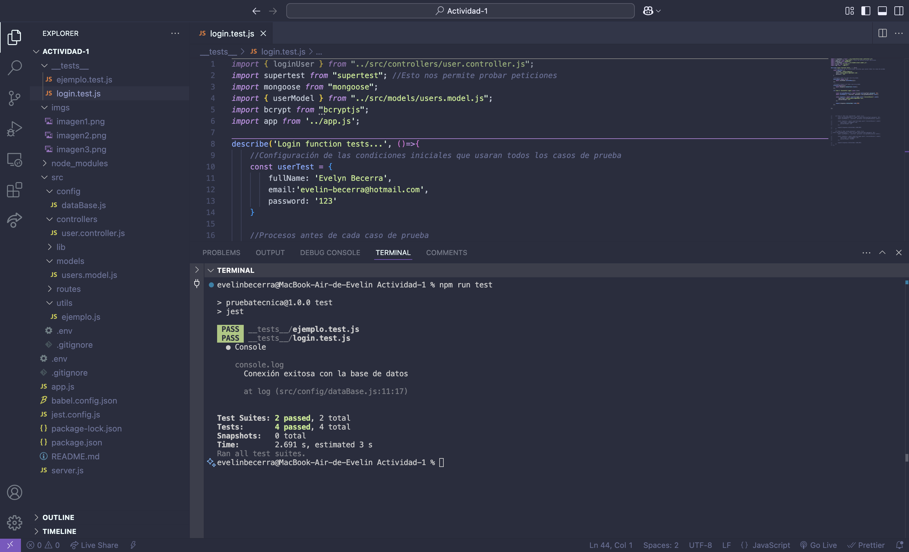
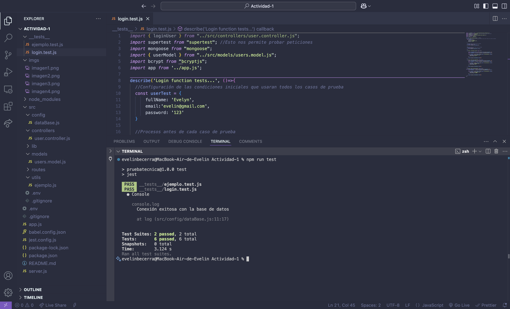

# Solución Prueba Técnica - Uso de Jest y Supertest en Node.js

---

## Objetivo del Repositorio 
- Reforzar los conocimientos aprendidos sobre creacciòn de proyectos de backend con Node 
- Proporcionar una guía práctica para implementar pruebas unitarias con **Jest**.  
- Enseñar el uso de **Supertest** para realizar pruebas de integración en APIs desarrolladas con **Express**.  
- Fomentar buenas prácticas en el desarrollo de aplicaciones robustas y testeables. 

## Contenido  
- 📂 **Estructura del proyecto**: Código de ejemplo organizado y modularizado para facilitar el aprendizaje.  
- 🛠️ **Configuración de Jest**: Incluye un archivo de configuración para comenzar a trabajar con Jest rápidamente.  
<!-- - 🔄 **Pruebas de integración con Supertest**: Ejemplos claros de cómo probar endpoints de una API.  
- ✅ **Cobertura de pruebas**: Ejemplo de cómo generar reportes de cobertura de código.  -->

---

## Prueba Técnica  
### Descripción  
| Área                  | Requisitos                                                                                   |
|-----------------------|---------------------------------------------------------------------------------------------|
| **Backend en Node.js**| - Implementar una API RESTful para operaciones CRUD en la colección "Users".<br>- Crear un servicio en el mismo controlador de "Users" para iniciar sesión autenticado por **JsonWebToken**. |
| **Base de Datos**     | - Utilizar **MongoDB** para almacenar a los usuarios.                                       |
| **Frontend en Angular**| - Crear una interfaz de usuario que permita registrar usuarios.<br>- Crear una interfaz que permita iniciar sesión a un usuario ya registrado. |

---

## Cómo Utilizar Este Repositorio  
### Requisitos Previos  
- Node.js v18+  
- MongoDB en ejecución (local o en la nube).  
- Angular CLI para trabajar con el frontend (opcional).  

### Paso a Paso  
1. Clona el repositorio:  
   ```bash
   git clone https://github.com/LuisaCastano40/BackendPruebaTecnica_BIT-_202407.git

2. Instala las dependencias necesarias: 
    ```bash
    npm install
3. Configura las variables de entorno en un archivo .env. Ejemplo:
    ```bash
    DB_PASSWORD = your_database_password
    DB_URL = your_database_uri
    SECRET_KEY = your_secret_key    
4. Ejecuta el servidor:
    ```bash
    npm run dev
5. Corre las pruebas unitarias:
    ```bash
    npm run test
6. (Opcional) Si trabajas con el frontend, sigue las instrucciones en la carpeta del proyecto Angular.

---

- **Autor:** Evelyn Becerra
- **GitHub:** [Github](https://github.com/evelin-bcr/Modulo4-Actividad-1)


## Taller


## 1. Creación del repositorio

## 2. Ejecución del servidor
 

## 3. Prueba exitosa
 
 
## 4. Prueba con error
 

## 5. Inicio de sesión caso 1
 

## 6. Pruebas de inicio de sesión exitosas
 
